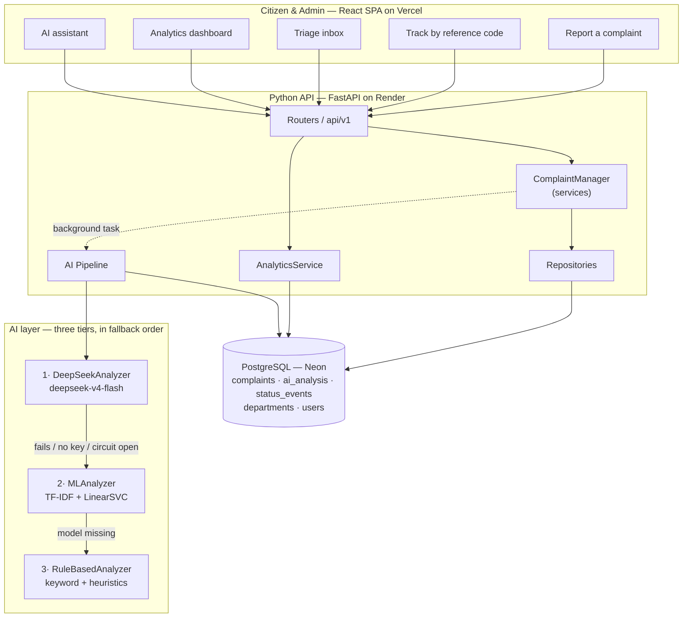
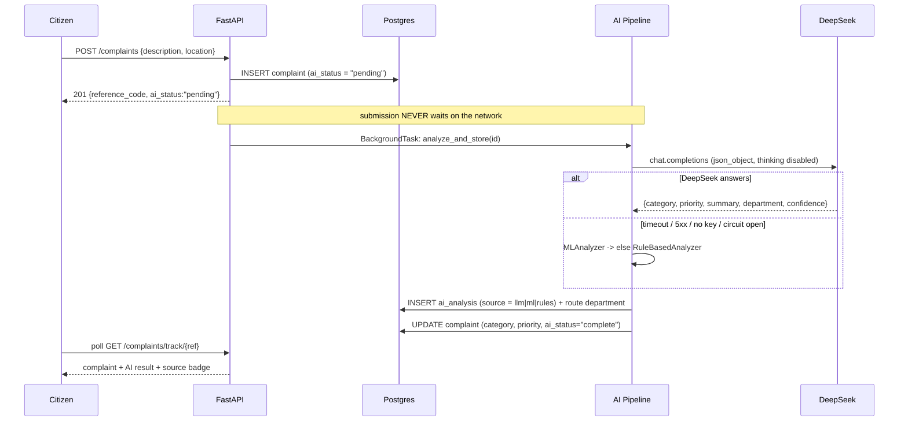
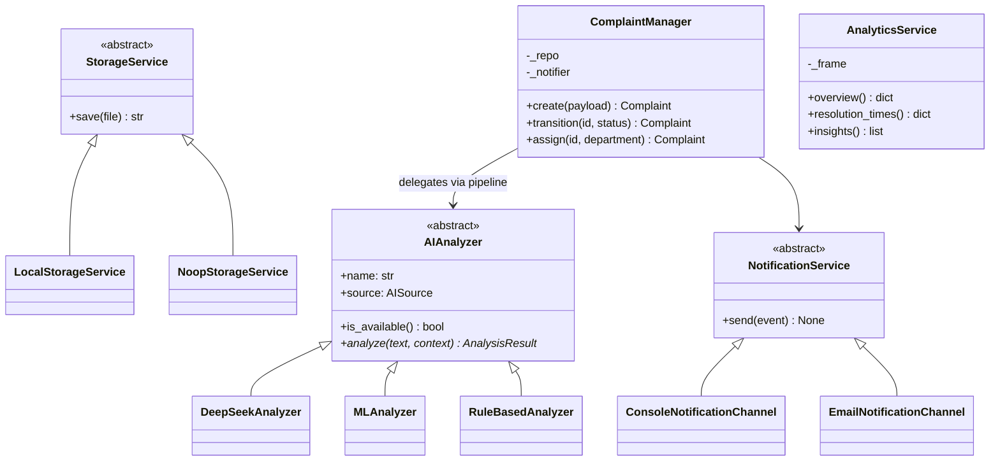

# Architecture — AI Smart Civic Services

## The problem in one line

A citizen writes *"there is a large water leak near the main road and traffic is becoming difficult"*.
That sentence is useless to a service team until something turns it into: **category**, **priority**,
**responsible department**, and a **one-line actionable summary**. That transformation is what this system does.

## System overview

## Where the AI sits, precisely

**AI input:** the raw complaint text plus light context (citizen-supplied location and optional category hint).
**AI processing:** a single JSON-mode chat completion against `deepseek-v4-flash` with a byte-stable system
prompt carrying the 7-category taxonomy, the 4 priority criteria and few-shot examples; the reply is parsed and
validated against a Pydantic model before it is trusted.
**AI output:** `category`, `priority`, `summary`, `department_suggestion`, `confidence`, `keywords`,
`is_emergency` — persisted to `ai_analysis` and used to set the complaint's own category, priority and
assigned department.
**Limitations:** documented in [AI_TESTING_EVIDENCE.md](../AI_TESTING_EVIDENCE.md).

## Why three AI tiers

A hackathon demo that depends on one API call is a demo that fails. Each tier degrades to the next:

| Tier | Technology | When it runs | Confidence | Cost |
|---|---|---|---|---|
| 1 | DeepSeek `deepseek-v4-flash` | Default | Highest — understands context, negation, Roman-Urdu | ~$0.0002/complaint |
| 2 | TF-IDF (word + char n-gram) → calibrated LinearSVC | No key, API error, or circuit breaker open | Good on typical phrasing | Free, local |
| 3 | Weighted keyword + emergency heuristics | Model artifacts missing | Coarse but never wrong-by-crash | Free, sub-millisecond |

The tier that produced each result is stored on the record and shown in the UI as a badge. The system never
pretends a rule-based guess came from the LLM.

## Layering rules

`Router → Service → Repository → Database`. A router never touches a session; a repository never contains
business logic. The AI pipeline is invoked by the service layer, never by a router, and it opens its own
session because it runs after the response has been sent.

## Class model (OOP benchmark)

Inheritance is used only where the subclasses are genuinely substitutable: the three analyzers are selected at
runtime by availability, and the storage/notification hierarchies are swapped by configuration. Nothing is a
class merely to satisfy a rubric.

## Statistics layer

Complaints are pulled once per request with SQL filters, loaded into a single pandas DataFrame, and every
metric is derived from that frame. Descriptive statistics use sample estimators (`ddof=1`). Resolution time is
reported by **median and IQR rather than mean**, because the distribution is strongly right-skewed — the
dashboard says so in words. Tukey fences (`Q1 − 1.5·IQR`, `Q3 + 1.5·IQR`) identify abnormally slow cases, which
surface as an actionable list rather than a number. A chi-square test of independence checks whether category
and priority are related, and reports its own expected-frequency assumption.

Every number is paired with a plain-English `Insight` sentence generated by a **deterministic rules engine**,
never by the LLM — so a statistic can never be hallucinated.

## Deployment

| Layer | Platform | Notes |
|---|---|---|
| Frontend | Vercel | Static Vite build, SPA rewrite, `VITE_API_URL` env var |
| Backend | Render (free web service) | uvicorn, `/health` health check, sleeps after ~15 min idle |
| Database | Neon Postgres (free) | Permanent free tier; async driver via `asyncpg` |
| AI | DeepSeek API | Called from the backend only — the key never reaches the browser |

Secrets live only in platform environment variables and a gitignored `.env`. No key is ever committed, and the
frontend never holds an AI credential.
